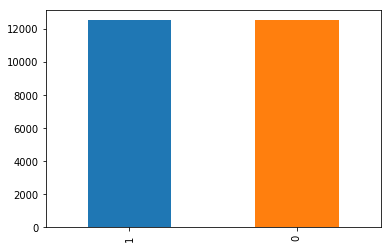
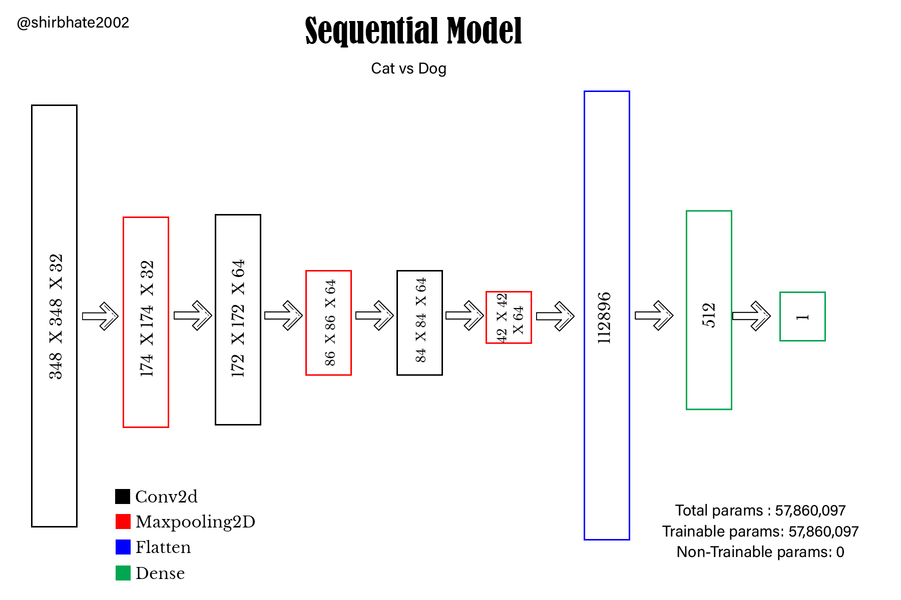

# Dogs-vs.-Cats-CNN
This Repository contain algorithm to classify whether images contain either a dog or a cat.  This is easy for humans, dogs, and cats. But computer will find it a bit more difficult.
# Kaggle Competition
https://www.kaggle.com/c/dogs-vs-cats
# Train Data Visualisation

* Training data contains 12500 images of each dog and cat
# Model 

## Prerequisites
  * Python 3.8
  * Tensorflow 
  * Tensorflow-gpu
  * numpy
  * matplotlib
